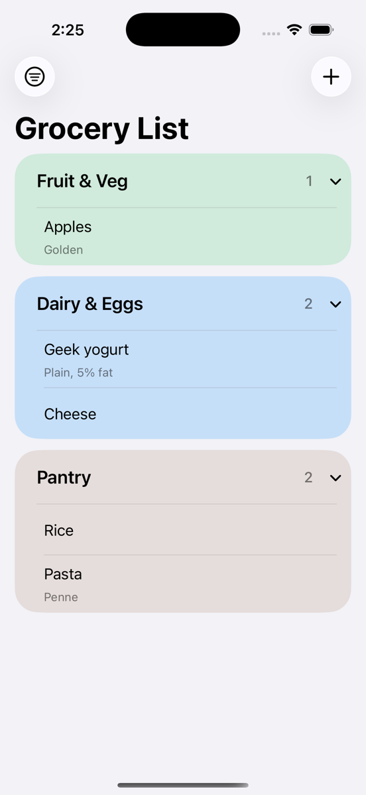
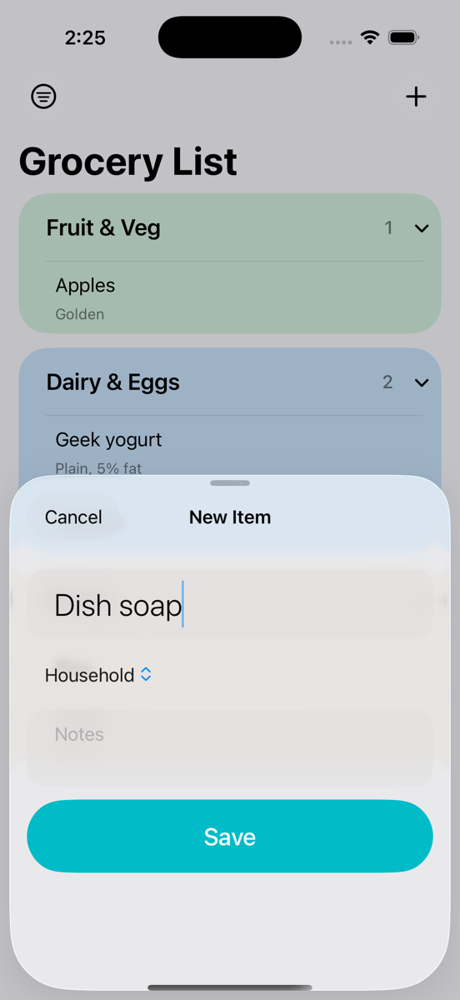
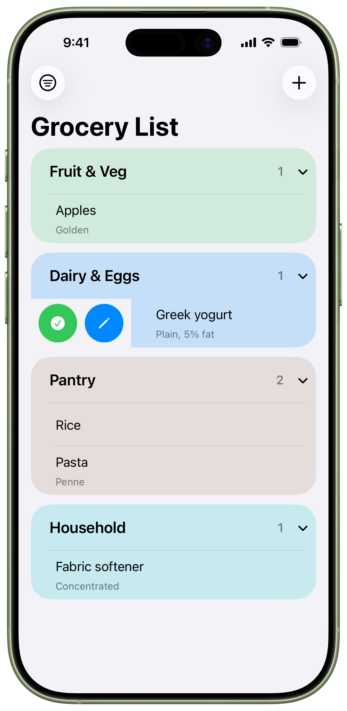
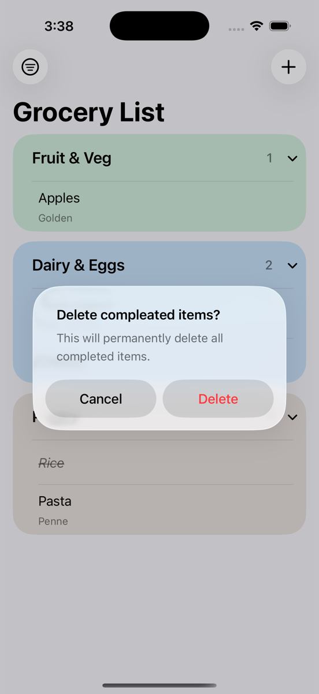
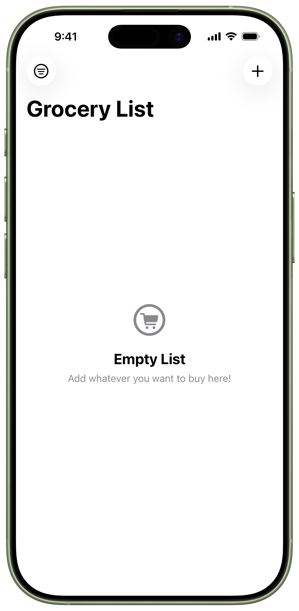

# Grocery List 🛒

A modern grocery list application built using SwiftUI and SwiftData.

This app focuses on clean UI design, structured architecture, and modern Apple frameworks introduced in iOS 17.

---

## Features

- Add, edit, and delete grocery items
- Category organization
- Mark items as purchased
- Persistent local storage using SwiftData
- Smooth animations and modern SwiftUI navigation
- Clean empty state design
- Dark mode support

---

## Tech Stack

- Swift
- SwiftUI
- SwiftData (iOS 17+)
- MVVM-style separation
- NavigationStack

---

## Screenshots

### Main Screen

  
  

---

### Add New Item

  

---

### Swipe Actions

  

---

### Delete Confirmation

  

---

### Empty State

  

---

## License

This project is licensed under the MIT License.
